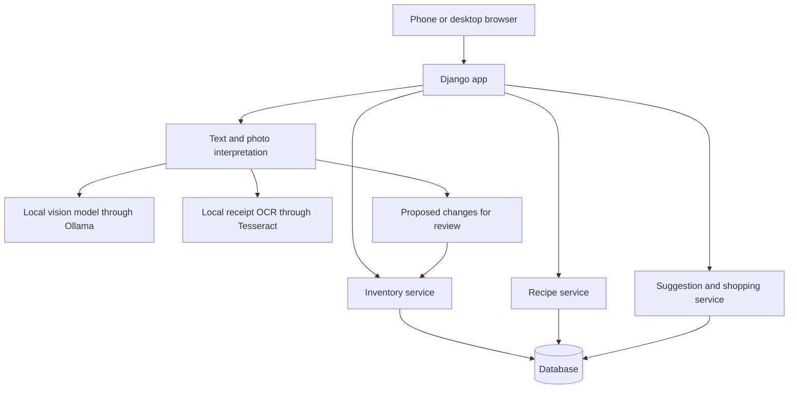

# Kitcher architecture

Design draft based on product decisions made on October 7, 2026.
This document describes the planned app; it does not imply that the app has been implemented.

## Product decisions

Kitcher is a personal pantry and grocery-planning app. Its first version should:

- Track approximate but usable quantities, such as six eggs or half a known bag of rice.
- Maintain an editable recipe book with explicit ingredients, quantities, default servings, and optional instructions.
- Suggest a few favorite recipes based on current inventory, with the ability to swap suggestions.
- Recommend purchases so any one selected recipe can be cooked at its chosen serving count.
- Accept inventory updates through text, fridge photos, receipt photos, and recording cooked recipes.
- Confirm interpreted inventory changes before applying them.
- Keep hosting costs as close to zero as practical.
- Require zero paid API or inference charges for photo recognition.
- Accept that photo recognition is available only while the user's computer is running.

Weekly meal planning and recommendations outside the user's recipe book are future work.

The initial shortlist size is three. This is a starting default, not a hard limit.

## Proposed technical architecture

Use a single Python/Django app with responsive, server-rendered pages and small amounts of JavaScript for uploads and interactive edits. Keep inventory arithmetic and recipe selection in Python service modules, separate from page rendering and input interpretation.

Django supplies database models, migrations, session authentication, and an admin interface for maintaining the initial recipe book. The user-facing pages should make everyday pantry updates, cooking, and shopping convenient on both a phone and a computer.



Run locally with SQLite while developing. Use PostgreSQL for a cloud deployment. Keep the core models and queries compatible with both databases. Moving to cloud storage will require migrating the existing local data; changing the connection settings alone does not copy it.

Use one pre-created account initially. Associate recipes, pantry records, imports, and selections with that account. Public signup and household sharing are outside the initial scope.

## Data model

| Record | Main fields and purpose |
| --- | --- |
| Ingredient | Canonical name, aliases, measurement dimension, and canonical unit. Matches names such as "eggs" and "large eggs" when the user confirms they are equivalent. |
| Package size | Ingredient, package label, amount, and unit. Converts "half a bag" into a usable amount when that bag's size is known. |
| Pantry item | Owner, ingredient, estimated quantity, canonical unit, version number, and last-confirmed time. One current balance per ingredient is sufficient initially. |
| Recipe | Owner, title, favorite flag, default servings, instructions, and revision number. |
| Recipe ingredient | Recipe, ingredient, amount, and unit for the recipe's default servings. |
| Recipe selection | Owner and selected recipes, with desired servings and ordering. Holds the current shortlist. |
| Inventory event and lines | Owner, source, timestamp, request identifier, affected ingredients, and quantity changes. Records purchases, cooking, corrections, and reversals. |
| Import draft | Owner, input type, proposed changes, unresolved fields, review status, and a source fingerprint when applicable. Keeps interpretation separate from confirmed inventory. |

Use decimal values for quantities. Store compatible quantities in canonical units: grams for mass, milliliters for volume, and counts for discrete items.

Convert within a measurement dimension, such as kilograms to grams. A mass-to-volume or count-to-mass conversion requires an ingredient-specific conversion; do not assume that one cup of every ingredient weighs the same amount.

"Half a bag" requires a known package size. Otherwise keep the quantity unresolved and ask for it during review. Unknown quantities must not silently become zero or arbitrary numerical estimates.

Every recipe ingredient is required initially. Optional ingredients, substitutions, expiration dates, and separate storage locations can be added later.

## Recipe suggestions

Start with a transparent, deterministic ranking of favorite recipes at their default servings:

1. Rank recipes with all required ingredients available first.
2. Among the rest, prefer fewer missing ingredients.
3. Break ties using average ingredient coverage, then a stable recipe identifier.

For each ingredient with a known pantry quantity, coverage is:

```text
coverage = min(available / required, 1)
```

Average the coverage fractions across the recipe's required ingredients. For ranking only, an unknown pantry quantity contributes no confirmed coverage and requires verification. Label it as unknown in the interface rather than displaying it as absent.

Show the reason for each suggestion, such as "ready to cook" or "missing eggs and yogurt." This ranking does not claim to minimize grocery spending; prices and store package sizes are not known initially.

Suggest three favorites and let the user replace any suggestion. Save the selected shortlist until the user refreshes it or swaps recipes. Inventory changes update readiness and shopping quantities without silently replacing the chosen recipes.

## Shopping calculation

The selected recipes are alternatives. Shared ingredients must cover the largest individual requirement, rather than the sum across recipes.

First scale each recipe to its selected servings:

```text
scaled requirement = recipe amount * selected servings / default servings
```

Then, for each ingredient:

```text
target = maximum scaled requirement across selected recipes
buy = max(target - known pantry quantity, 0)
```

For example:

| Ingredient | Recipe A needs | Recipe B needs | Pantry has | Target | Buy |
| --- | ---: | ---: | ---: | ---: | ---: |
| Eggs | 2 | 3 | 1 | 3 | 2 |
| Rice | 200 g | 300 g | 100 g | 300 g | 200 g |

After shopping, the user can choose either recipe. This does not promise enough ingredients to cook both consecutively. After cooking, recompute readiness and shortages for the same shortlist.

For unknown inventory amounts, show "check how much you have" before giving a definitive purchase quantity. Keep purchase amounts as ingredient shortfalls initially; package rounding can be added when package information is available.

Checking an item off a shopping list does not itself increase inventory. A confirmed purchase, receipt import, or manual update does.

## Inventory update flows

### Fridge photos: reconcile a partial snapshot

Interpret visible ingredients and quantities, then propose current amounts for review. A photo is a partial observation, so items not visible in it remain unchanged. Identify uncertain amounts and ask the user to fill them in.

Setting an observed amount is different from adding a purchase. Confirming a photo showing six eggs sets the observed balance to six; it does not add another six to an existing balance.

### Receipts: add purchases

Extract line items, match them to ingredients, and resolve package sizes or missing quantities during review. Receipt descriptions and prices alone may not establish ingredient amounts.

Save a source fingerprint to flag possible duplicate imports. Applying the same confirmed draft twice must not add the same purchases twice.

### Text: distinguish the intended operation

Support additions, consumption, and current-balance corrections, for example:

- "Bought six eggs": add six eggs.
- "Used two eggs": subtract two eggs.
- "I have six eggs left": set the current balance to six eggs.

Show the interpreted operation and resulting balance before confirmation.

### Cooking: subtract actual usage

Open a recipe, choose servings, and preview the resulting ingredient deductions. Let the user adjust actual quantities before confirming.

Record the recipe revision, serving count, and actual ingredient deductions with the cooking event. Later recipe edits must not alter historical consumption.

If a deduction exceeds tracked stock, ask the user to reconcile the discrepancy rather than silently creating negative inventory.

## Consistency and corrections

Apply each confirmed update and its inventory-event lines in one database transaction. Use a unique request identifier so retries cannot duplicate a purchase or cooking event.

Check the inventory version when confirming a draft. If inventory changed after the preview, recalculate the proposed balances and show the updated result before applying it.

Undo should create a reversal event, preserving the history. If later updates affect the same ingredient, preview the reversal against the current balance and resolve any discrepancy instead of blindly restoring an old balance.

Photo and text interpretation never directly writes pantry balances. Its output must pass the same ingredient, unit, quantity, and confirmation checks as manual input.

## Hosting and processing costs

The app can be developed and used on one computer with no hosting charge. Phone access on the home network is possible while that computer is running, but access away from home needs a deployment or another remote-access arrangement.

A proposed cloud starting point is a Render Free web service with a Neon Free PostgreSQL database, subject to their usage limits. Render's free service sleeps after 15 idle minutes and may take about a minute to wake. Its local filesystem is temporary, so neither SQLite nor uploaded photos should be persisted there. Render's own free PostgreSQL offering expires after 30 days, so use an external database for this plan.

Keep photos temporary by default: process them for review and retain the confirmed structured data. If processing becomes asynchronous or drafts need to survive restarts, use persistent object storage with a retention policy. Do not put image binaries in the pantry database.

Photo recognition must have no paid API or inference charges. The proposed approach uses the user's existing computer for processing, with no paid-provider fallback. Free hosted-model quotas are not a dependency of the core workflow. This requirement concerns service charges; the local application uses the computer's existing hardware and resources.

### Local photo interpretation

Use Ollama to run a locally downloaded vision model. Begin by evaluating `gemma3:4b`, an image-capable model whose Ollama download is approximately 3.3 GB. This is an initial candidate, not a claim that its pantry recognition has been validated. Pin the chosen model version/digest after evaluating representative fridge and receipt photos.

The user's computer was inspected on October 7, 2026: approximately 32 GB system RAM, an AMD Ryzen 9 3950X processor, and an NVIDIA RTX 2070 SUPER with 8 GB GPU memory. These specifications make a small local-model trial reasonable; actual speed, memory usage, and recognition quality still need measurement. Ollama and Tesseract were not found on the terminal PATH during this check; no software or models were installed as part of this architecture update.

For fridge images, request visible ingredient candidates, visible counts or label quantities, and explicit unresolved quantities. Do not invent weights for containers or infer that hidden items are absent. Validate the structured result and resolve ambiguous ingredient matches in the review screen.

For receipts, use Tesseract for local text recognition, then parse line items using store abbreviations, the ingredient/package catalog, and the local model when helpful. Tesseract recognizes text; it does not itself establish ingredient identity, package sizes, or purchase quantities. Show unresolved abbreviations and amounts during review.

Configure Ollama in local-only mode with `OLLAMA_NO_CLOUD=1`. Keep its API bound to loopback and have the Django backend call it; browsers should submit photos to the application rather than access the model server directly. Restrict the app to its configured local model and endpoint. If local processing is unavailable, provide a clear pending/failed state and manual entry without contacting a paid service.

### Device access and deployment

The initial deployment plan runs both Django and recognition on the computer, using local SQLite storage. A phone can upload photos through Kitcher's responsive interface on the same home network while the computer is running. Keep account authentication in place for network access. The local model service remains private to the computer. Back up the database and provide a structured data export so the pantry and recipe book can be recovered or moved later.

If Django is later deployed to a free cloud host, its `localhost` address does not reach the user's computer. Keep recognition as a separate local worker that fetches authenticated jobs over outbound connections. This requires persistent job records and temporary image storage. The worker processes jobs only while the computer is running; otherwise photo imports remain queued and manual inventory editing stays available. Do not assume that free web hosting also provides the resources needed for the vision model.

The user confirmed that recognition does not need to work while the computer is off. Computer-dependent processing is therefore an accepted first-version constraint. Remote hosting remains an optional future extension rather than a prerequisite for the first version.

## Implementation sequence

1. Create the Django project, account, models, and migrations. Provide recipe editing and pantry quantity editing.
2. Implement recipe ranking, saved shortlist swaps, serving adjustments, and the shopping calculation.
3. Add cooking deductions, update history, corrections, and undo.
4. Benchmark a local vision model and receipt OCR, then add text, receipt, and fridge-photo import drafts, review, and duplicate protection. Include local-only model configuration and graceful manual entry when processing is unavailable.
5. Provide local startup instructions, authenticated phone access on the home network, and a database export/backup procedure. If remote hosting is wanted later, migrate data and add the local processing worker.

These are implementation milestones. Photo input remains part of the intended first-version workflow, even though the deterministic foundation is built first.

Validate the core behavior with focused tests: shared ingredients use a maximum, serving changes scale requirements, incompatible units require resolution, photos do not remove unseen items, repeated confirmations do not double-count, and recipe edits do not rewrite cooking history.

## Decisions still open

- The local vision model to retain after measuring speed and recognition quality.
- Whether the three-recipe default feels right after trying the app.

The first version starts locally. Photo-processing service charges are fixed at $0, and processing only while the computer is running is accepted.

## Sources

- [Django overview](https://docs.djangoproject.com/en/6.1/intro/overview/)
- [Render free-service limits](https://render.com/docs/free)
- [Neon free-plan details](https://neon.com/blog/neon-free-plan-1-gb-per-project)
- [Ollama vision API](https://docs.ollama.com/capabilities/vision)
- [Ollama local-only mode and network binding](https://docs.ollama.com/faq)
- [Gemma 3 4B model details](https://ollama.com/library/gemma3:4b)
- [Tesseract OCR documentation](https://tesseract-ocr.github.io/tessdoc/)

Hosting information was checked on October 7, 2026. Confirm the limits again when deploying.
